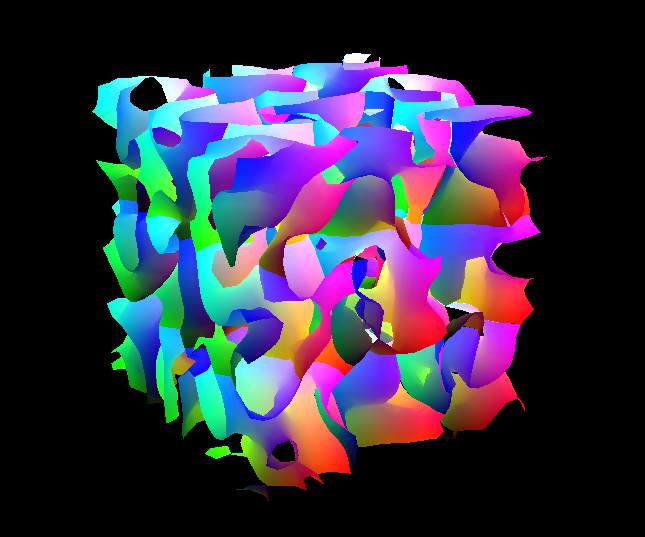

Marching Cubes in Compute Shader
================================

This is a sample of how to compute the isosurface of a density field with the Marching Cubes algorithm inside OpenGL/GLSL Compute Shaders.

How it works:
--------------
1. The voxel data is filled into a (3D) array on the CPU and stored in a shader buffer, let's call it SB1. This shader buffer acts as input to the Marching Cubes algorithm. Note that an alternative would be to compute the density field (for example, using noise) on the GPU instead, which would eliminate the need for this shader buffer and reduce the amount of data which needs to be passed from the CPU to the GPU. However, my data will be generated on the CPU, so this system works well for me.
2. Another shader buffer, SB2, is created to hold the generated geometry. This will act as a method to transfer the output of the Marching Cubes algorithm and will be used as input to the following vertex/fragment shaders. In particular, it will hold the vertex positions and triangles as generated by the Marching Cubes. It is initialized with as many vertices as the algorithm would need in the worst case (5 triangles per voxel, i.e. 15 points per voxel).
3. A compute shader is created and SB1 and SB2 are passed to it. The compute shader calculates the marching cubes and stores the results in SB2. All points which are not required are set to position (0,0,0)
4. A geometry object is created with some dummy vertices/triangles.
5. A vertex shader is added to the geometry object, and SB2 is passed to it. When invoked on each of the vertices, the vertex shader replaces the position of the vertex with the position given in the SB2.

Requirements:
--------------
- python3
- Panda3D
- Graphics card capable of at least OpenGL 4.3

Limitations:
--------------
- The system currently creates 15 points (5 triangles) per voxel at startup. Many of these do not end up getting rendered, because many voxels may require less than 5 triangles. This is done because there's no way of knowing beforehand how many points will be required for a given voxel. Points which are not needed are set to (0,0,0), creating zero-area triangles.
- Currently only allows for solid rendering (no normal smoothing performed yet)

Credits:
--------------
This was inspired by the "embers" sample from rdb, which shows how to pass geometry from a compute shader to later shader stages.
Textures are from Texture Haven (https://texturehaven.com/) - thanks!
